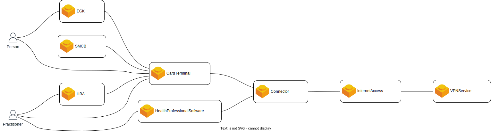

= 🪢 Telematik API Tools

This repository contains a set of tools for producing and using the gematik API documentation

== System Model

TI is a complex infrastructure consisting of variety of software and hardware systems. To describe the TI we use the following *Systen Model*:

* *System*: any hardware or software system that is either part of the TI or is required to use and operate the TI
* *Component*: depending on the complexity of a *System* it can be decomposed into parts.
* *Interface*: any kind of electrical, network, software or logical interfaces provided by the *Systems* or it's *Components*. The interfaces allow the the interactions between the *Systems*
* *ApprovalObject*: combines one or more *Systems* to subject of an approval process (german: Zulassung).
* *User*: a person or an organisation which uses a system 
* *Operator*: a person or an organisation which operates a system

== TI Overview

